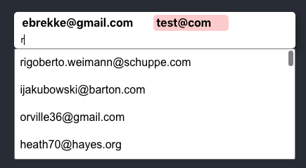

# react-multi-select

> React multi select component

## Available Scripts

In the project directory, you can run:

### `npm start`

Runs the app in the development mode.
Open [http://localhost:3000](http://localhost:3000) to view it in the browser.

### `npm test`

Launches the test runner in the interactive watch mode.

### `npm run build`

Builds the app for production to the `build` folder.
It correctly bundles React in production mode and optimizes the build for the best performance.
